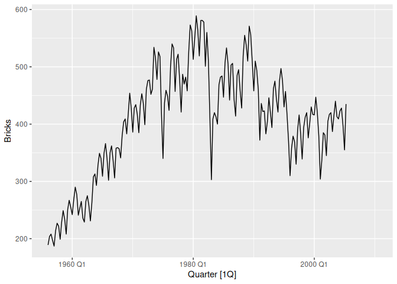

<!-- README.md is generated from README.Rmd. Please edit that file -->

# ggtime

<!-- badges: start -->

[](https://lifecycle.r-lib.org/articles/stages.html#experimental)
[](https://CRAN.R-project.org/package=ggtime)
<!-- badges: end -->

The ggtime package provides tools for graphically analysing time series,
with exploration of trend and seasonality. It utilises the tsibble data
format for time series and produces plots with ggplot2.

## Installation

You can install the development version of ggtime from
[GitHub](https://github.com/) with:

``` r
# install.packages("remotes")
remotes::install_github("tidyverts/ggtime")
```

## Example

``` r
library(ggtime)
library(tsibble)
#> 
#> Attaching package: 'tsibble'
#> The following objects are masked from 'package:base':
#> 
#>     intersect, setdiff, union
tsibbledata::aus_production %>% 
  autoplot(Bricks)
#> Warning: Removed 20 rows containing missing values (`geom_line()`).
```


