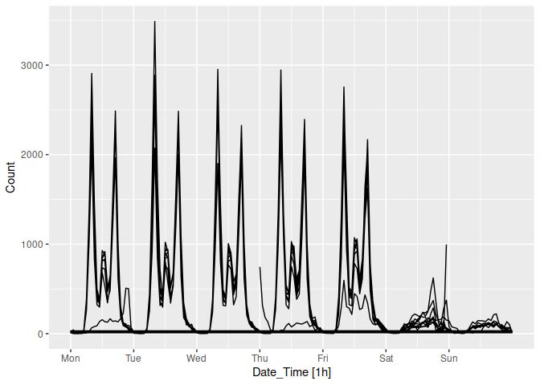

<!-- README.md is generated from README.Rmd. Please edit that file -->

# ggtime

<!-- badges: start -->

[](https://lifecycle.r-lib.org/articles/stages.html#experimental)
[](https://CRAN.R-project.org/package=ggtime)
<!-- badges: end -->

The ggtime package provides tools for graphically analysing time series,
with exploration of trend and seasonality. It utilises the tsibble data
format for time series and produces plots with ggplot2.

## Installation

You can install the development version of ggtime from
[GitHub](https://github.com/) with:

``` r
# install.packages("remotes")
remotes::install_github("tidyverts/ggtime")
```

## Example

``` r
library(ggtime)
#> Registered S3 method overwritten by 'tsibble':
#>   method               from 
#>   as_tibble.grouped_df dplyr
library(tsibble)
#> 
#> Attaching package: 'tsibble'
#> The following objects are masked from 'package:base':
#> 
#>     intersect, setdiff, union
library(ggplot2)
tsibbledata::aus_production %>% 
  autoplot(Bricks)
#> Warning: Removed 20 rows containing missing values or values outside the scale range
#> (`geom_line()`).
```


``` r

cal_trans_x <- function() {
  scales::trans_new(
    name = "calendar",
    transform = ggtime:::calendar_wrap,
    inverse = identity,
    breaks = scales::breaks_pretty(),
    domain = c(0, 60*60*24*7)
  )
}

pedestrian[with(pedestrian, Sensor == "Southern Cross Station" & Date < "2015-03-01"),] |> 
  autoplot(Count) +
  # coord_calendar(xlim = c(Sys.time(), Sys.Date() + lubridate::days(1)))
  ggplot2::coord_trans(x = cal_trans_x(), xlim = as.POSIXct(c("2024-03-25 00:00:00", "2024-03-31 23:59:59"))) +
  scale_x_datetime(date_breaks = "day", date_labels = "%a")
#> Warning in max(x): no non-missing arguments to max; returning -Inf
#> Warning in min.default(structure(numeric(0), class = "Date"), na.rm = FALSE):
#> no non-missing arguments to min; returning Inf
#> Warning in max.default(structure(numeric(0), class = "Date"), na.rm = FALSE):
#> no non-missing arguments to max; returning -Inf
```


